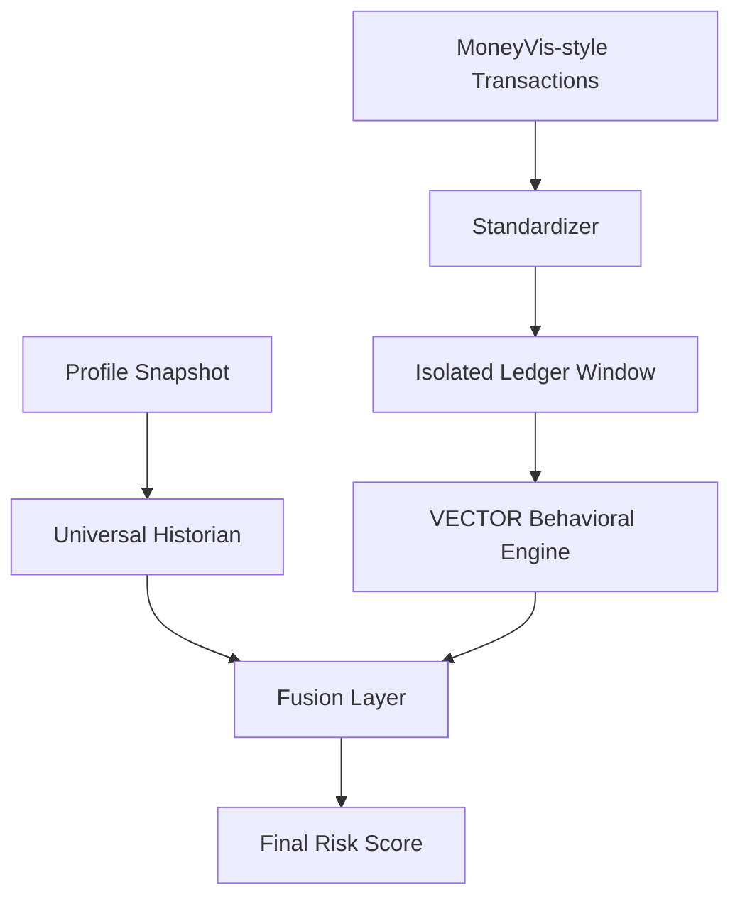

# Dual-Model Real-Time Risk Engine

This module turns the repo's research assets into one runtime risk engine. It combines:

- **Universal Historian** for slow-moving structural baseline risk
- **VECTOR Behavioral Engine** for fast-moving transaction risk
- a **score-only fusion layer** that converts both model scores into one final real-time risk score

## Runtime Flow



The historian answers: "How structurally fragile is this customer?"

The behavioral model answers: "How risky is this customer's recent financial trajectory?"

The fusion layer answers: "Given both views, what is the current final risk score?"

## Model Roles

### Universal Historian

- Pure structural baseline scorer, not a streaming model
- Runtime artifact: `models/universal_historian_v1.pkl`
- Feature order source of truth: `models/universal_features_map.pkl`
- Accepts raw structural profile fields and derives the ratio features internally

Required raw profile fields:

- `annual_inc`
- `loan_amnt`
- `dti`
- `term_months`
- `open_acc`
- `total_acc`
- `revol_bal`
- `revol_util`
- `delinq_2yrs`
- `pub_rec`
- `inq_last_6mths`
- `installment`

Derived historian features:

- `loan_to_income_ratio = loan_amnt / annual_inc`
- `installment_burden = installment / (annual_inc / 12)`

Canonical historian feature order:

1. `annual_inc`
2. `loan_amnt`
3. `dti`
4. `term_months`
5. `open_acc`
6. `total_acc`
7. `revol_bal`
8. `revol_util`
9. `delinq_2yrs`
10. `pub_rec`
11. `inq_last_6mths`
12. `loan_to_income_ratio`
13. `installment_burden`

Runtime preprocessing mirrors the training pipeline:

- numeric coercion
- sentinel correction
- null fill
- capping of impossible values
- ratio derivation
- final reordering by `universal_features_map.pkl`

### VECTOR Behavioral Engine

- Fast-moving transactional risk scorer
- Runtime artifact: `models/behavioral_engine_v2.pkl`
- Artifact format: dict with `model`, `threshold`, and `features`
- Uses isolated per-customer transaction history over the latest 180 days

Canonical behavioral feature order:

1. `income_erosion_v`
2. `liquidity_momentum_v`
3. `overdraft_v`
4. `overdraft_t2`
5. `salary_drift_v`
6. `tx_freq_v`
7. `avg_balance_t2`
8. `min_balance_t2`
9. `total_out_t2`

Behavioral runtime rules:

- standardize MoneyVis-style transactions into the universal ledger
- isolate history by `account_id`
- compute 180-day T1/T2 signals
- apply PPP scaling only to:
  - `avg_balance_t2`
  - `min_balance_t2`
  - `total_out_t2`
- preserve the model artifact threshold `0.46`

## Data Contracts

### Structural Profile Ingestion

The historian scorer expects a raw profile payload with:

```python
{
    "annual_inc": float,
    "loan_amnt": float,
    "dti": float,
    "term_months": float,
    "open_acc": float,
    "total_acc": float,
    "revol_bal": float,
    "revol_util": float,
    "delinq_2yrs": float,
    "pub_rec": float,
    "inq_last_6mths": float,
    "installment": float,
}
```

Historian outputs:

- `historian_score`
- `historian_scored_at`
- `historian_model_version`

### Transaction Ingestion

The behavioral path expects MoneyVis-like fields:

```python
[
    "Transaction Date",
    "Transaction Description",
    "Transaction Type",
    "Debit Amount",
    "Credit Amount",
    "Balance",
]
```

Behavioral outputs:

- `behavioral_score`
- `behavioral_scored_at`
- `behavioral_model_version`
- optional `signals`

### Unified Inference

Unified inference returns:

- `historian`
- `behavioral`
- `final_risk_score`
- `status`

## Fusion Layer

The fusion layer is a score transformer. It is not a weighted ensemble and it does not emit categories.

Formula:

```text
final_risk_score = clamp(historian_score + 0.30 * (behavioral_score - 0.50), 0.0, 1.0)
```

Meaning:

- historian score anchors structural risk
- behavioral score applies a bounded moderate override
- max behavior-driven movement is `+/- 0.15`

Fallback behavior:

- if historian is missing, return behavioral as provisional final score
- if behavioral is missing, return historian as final score
- if both are missing, return `INSUFFICIENT_DATA`

## Usage

```python
from src.inference import RiskEngine

engine = RiskEngine()

historian = engine.score_profile(profile_payload)
behavioral = engine.score_behavioral(transaction_df, account_id="A123")
combined = engine.predict_risk(
    raw_tx_df=transaction_df,
    profile=profile_payload,
    account_id="A123",
)
```

## Validation Targets

- historian feature order matches `universal_features_map.pkl`
- historian derives ratio features from raw profile inputs
- behavioral artifact preserves threshold `0.46`
- fusion score stays in `[0, 1]`
- historian-only and behavioral-only fallbacks work
- multi-account ledger isolation remains intact
