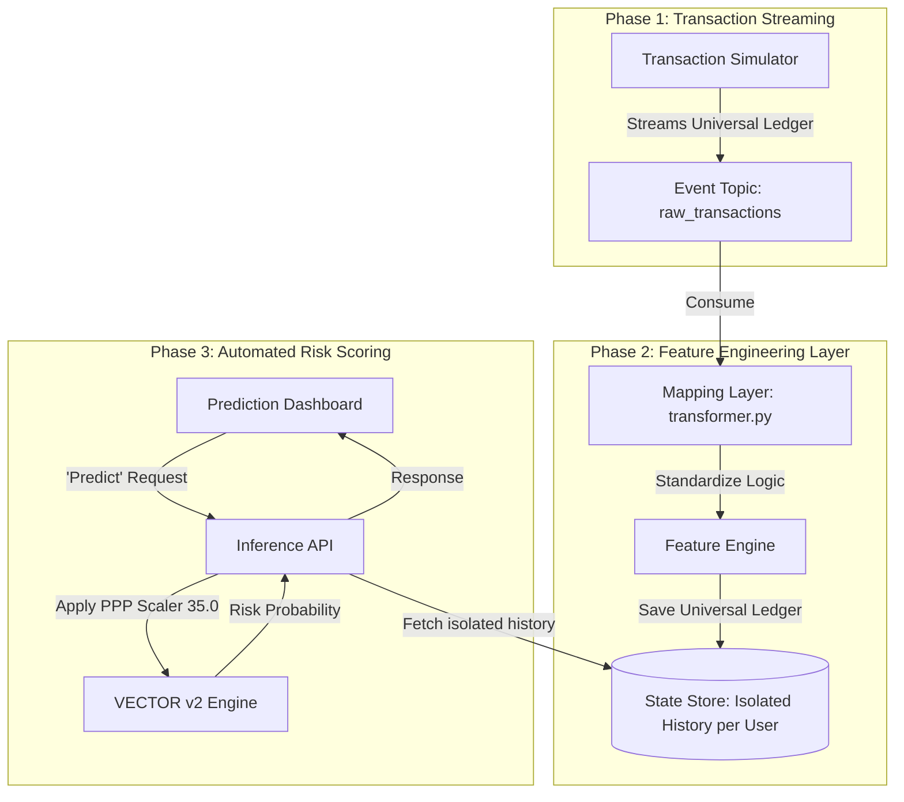

# Updated Implementation Plan: Real-Time Vector Risk Engine (v2)

This plan integrates the **VECTOR v2 Behavioral Model** into a real-time environment, specifically optimized to handle continuous transaction streams and isolated per-customer inference using the Universal Ledger schema.

---

## 🏗️ 1. System Architecture

---

## 🛠️ 2. Component Breakdown

### I. Data Simulation (Transaction Producer)
*   **Source:** Uses a synthetic template aligned with the portfolio requirements.
*   **Schema:** Streams `Transaction Date`, `Type`, `Description`, `Debit`, `Credit`, `Balance`.
*   **Isolated Identities:** The producer loops over the dataset but assigns unique IDs to simulate multiple different customers acting simultaneously.

### II. Mapping & Transformation Layer
As detailed in the documentation, this middleware will:
*   **Standardize:** Convert raw descriptions and types into universal tags: `SALARY`, `BILL`, `UNCATEGORIZED`.
*   **Window Management:** Ensure every transaction is mapped to a customer's temporal sequence.
*   **Persistence:** Store transactions in a way that allows fast retrieval of the last 180 days for a *specific* user without data leakage from other users.

### III. Isolated Risk Processor (Vector v2 Engine)
Upon a trigger:
1.  **Context Loading:** Fetch the exact transaction history for the target `account_id` only.
2.  **Velocity Calculation:** Compute the **9 signals** (Income Erosion, Liquidity Momentum, etc.) using the 90-day T1/T2 split.
3.  **Economic Alignment:** Multiply absolute currency outputs (`avg_balance`, `total_out`, `min_balance`) by the **ECONOMIC_PPP_SCALER = 35.0**.
4.  **Threshold Enforcement:** Apply the **0.46 F2-Optimal threshold** from the V2 model to generate the `Distressed` flag.

---

## 🚀 3. Execution Roadmap

### Step 1: Schema Lockdown
Define the Pydantic/JSON schema for the `raw_transactions` topic to mirror the internal Unified Ledger requirements.

### Step 2: The Standardization Worker
Implement a Python worker that consumes events and applies the keyword-matching logic from the `UniversalTransformer`.

### Step 3: State Store Setup 
Deploy a database (e.g., MongoDB) indexed by `account_id` and `timestamp` to ensure the risk engine pulls isolated histories in sub-100ms.

### Step 4: The V2 Model API 
Wrap the `behavioral_engine_v2.pkl` in a FastAPI service that performs the final windowing and mathematical scaling.

---
*Drafted based on VECTOR behavioral model v2 architecture and universal feature engineering logic.*
